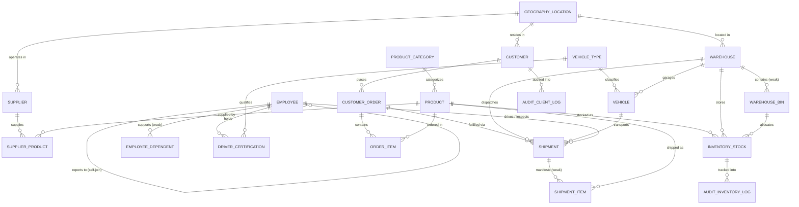

# LogiChain: Enterprise Supply Chain & Logistics Management System
### Reference Implementation & Comprehensive Academic Documentation for CSE3001 Database Management Systems

---

## Executive Overview

**LogiChain** is an enterprise-grade, high-throughput Supply Chain, Fleet Logistics, Warehouse Management, and Dimensional Analytics Database System. It is engineered from first principles to provide a complete reference implementation and exhaustive documentation covering **100% of the CSE3001 Database Management Systems syllabus (Units 1–5 and Lab Experiments 1–11)**.

### Key Highlights:
- **Dual-Target Database Engine**:
  - **PostgreSQL / SQLite Core**: Runnable relational DDL, `PL/pgSQL` stored procedures/functions, triggers, materialized views, composite B+ Tree indexing, and MVCC concurrency simulations.
  - **Oracle 19c/21c PL/SQL Compatibility Suite**: Modular PL/SQL Packages, explicit cursors with `FOR UPDATE WHERE CURRENT OF`, savepoint batch transactions, user-defined exceptions with `RAISE_APPLICATION_ERROR`, sequences, and synonyms.
- **Interactive Verification & Simulation Suite**:
  - Python 3.11+ (FastAPI + Rich Terminal CLI) equipped with interactive ACID isolation anomaly generators (Dirty/Non-Repeatable/Phantom Reads), Deadlock & Wait-For Graph simulators, and Distributed Two-Phase Commit (2PC) harnesses.
- **Academic Documentation Suite**:
  - Formal Relational Algebra & Tuple Relational Calculus (TRC) expressions, Codd's 12 Rules audit, mathematical 1NF $\rightarrow$ 4NF normalization proofs with Multi-Valued Dependencies (MVDs), B+ Tree node mechanics, Cost-Based Optimizer models, and ARIES crash recovery workflows.

---

## CSE3001 Syllabus & Lab Experiments Coverage Matrix

| Unit / Lab No. | Topic in Syllabus | LogiChain Implementation | Source File Link |
| :--- | :--- | :--- | :--- |
| **Unit 1** | ANSI-SPARC 3-Level Architecture, Data Independence, ER Diagrams, Weak Entity Sets, Attribute Types, Cardinalities | 3-Level Views, ER Crow's Foot specs, weak entities (`SHIPMENT_ITEM`, `WAREHOUSE_BIN`, `DEPENDENT`), composite/multivalued mappings. | [database_design.md](file:///home/muaviz/collegedev/logichain/docs/database_design.md), [er_diagram.mermaid](file:///home/muaviz/collegedev/logichain/docs/diagrams/er_diagram.mermaid) |
| **Unit 2** | Relational Models, Integrity Rules, Relational Algebra, Calculus (TRC), Codd's Rules, Normalization (1NF to 4NF) | Foreign key actions (`ON DELETE CASCADE`), formal $\sigma, \pi, \bowtie, \div, \cup, -, \rho, \gamma$ queries, Codd's audit, 1NF–4NF proofs. | [relational_algebra.md](file:///home/muaviz/collegedev/logichain/docs/theoretical/relational_algebra.md), [normalization_proofs.md](file:///home/muaviz/collegedev/logichain/docs/theoretical/normalization_proofs.md), [codds_rules.md](file:///home/muaviz/collegedev/logichain/docs/theoretical/codds_rules.md) |
| **Unit 3** | SQL DDL/DML/TCL, Joins, Subqueries, Aggregate Functions, Updatable & Materialized Views, Triggers, Sequences, Indexes | Master DDL, complex multi-table joins, correlated `EXISTS`, updatable views `WITH CHECK OPTION`, performance indexes. | [01_ddl_tables.sql](file:///home/muaviz/collegedev/logichain/sql/schema/01_ddl_tables.sql), [01_performance_indexes.sql](file:///home/muaviz/collegedev/logichain/sql/indexes/01_performance_indexes.sql), [01_updatable_views.sql](file:///home/muaviz/collegedev/logichain/sql/views/01_updatable_views.sql) |
| **Unit 4** | PL/SQL, %TYPE, %ROWTYPE, Cursors, Stored Procedures/Functions, Storage & RAID, B+ Trees, Dynamic Hashing, Query Optimization | PL/pgSQL & Oracle PL/SQL packages, explicit cursors, B+ Tree mathematical models, RAID 0/1/5/10 analysis, CBO formulas. | [02_oracle_packages.sql](file:///home/muaviz/collegedev/logichain/sql/plsql_oracle/02_oracle_packages.sql), [storage_and_raid.md](file:///home/muaviz/collegedev/logichain/docs/architecture/storage_and_raid.md), [indexing_bplus_trees.md](file:///home/muaviz/collegedev/logichain/docs/architecture/indexing_bplus_trees.md), [query_optimization.md](file:///home/muaviz/collegedev/logichain/docs/performance/query_optimization.md) |
| **Unit 5** | ACID Properties, Isolation Levels, Serializability, Concurrency Control (2PL, Deadlocks, MVCC, 2PC), ARIES Recovery | Concurrency test runner, deadlock detector, 2PC simulation, Strict/Rigorous 2PL specs, ARIES Analysis/Redo/Undo workflows. | [acid_and_isolation.md](file:///home/muaviz/collegedev/logichain/docs/transactions/acid_and_isolation.md), [concurrency_control.md](file:///home/muaviz/collegedev/logichain/docs/transactions/concurrency_control.md), [recovery_and_aries.md](file:///home/muaviz/collegedev/logichain/docs/transactions/recovery_and_aries.md) |
| **Lab 1** | Airline Flight & Pilot Certification (Complex Joins & Division) | Fleet vehicle and driver certification queries with Relational Division ($\div$) over certified vehicles. | [lab01_certification_queries.sql](file:///home/muaviz/collegedev/logichain/sql/queries/lab_equivalents/lab01_certification_queries.sql) |
| **Lab 2** | Sailors, Boats & Reserves (25 Queries: ALL, ANY, Aggregations, Outer Joins) | Complete 25-query benchmark catalog on Driver/Fleet operations matching all 25 queries. | [lab02_sailors_25_queries.sql](file:///home/muaviz/collegedev/logichain/sql/queries/lab_equivalents/lab02_sailors_25_queries.sql) |
| **Lab 3** | Wholesale Multi-Dimensional Data Warehouse (Product, Spatial, Time, Sales) | Star/Snowflake schema (`FACT_SALES_SHIPMENT`, `DIM_*`) with OLAP aggregations (`ROLLUP`, `CUBE`, material/city analytics). | [03_data_warehouse_star_schema.sql](file:///home/muaviz/collegedev/logichain/sql/schema/03_data_warehouse_star_schema.sql), [lab03_dimensional_olap.sql](file:///home/muaviz/collegedev/logichain/sql/queries/lab_equivalents/lab03_dimensional_olap.sql) |
| **Lab 4** | Shipping Manifest Implicit Cursor & Hot DB Backup Script | PL/SQL block utilizing `SQL%FOUND`, `SQL%ROWCOUNT` + hot database backup/restore shell automation. | [03_oracle_cursors_savepoints.sql](file:///home/muaviz/collegedev/logichain/sql/plsql_oracle/03_oracle_cursors_savepoints.sql), [backup_restore.sh](file:///home/muaviz/collegedev/logichain/scripts/backup_restore.sh) |
| **Lab 5** | Transparent Audit System on Client_Master (`AUDIT_CLIENT_LOG`) | Trigger tracking `UPDATE` and `DELETE` on `CUSTOMER` with before-image balance, operation type, user, and timestamp. | [01_audit_triggers.sql](file:///home/muaviz/collegedev/logichain/sql/triggers/01_audit_triggers.sql) |
| **Lab 6** | Supplier & Parts Cursor with Savepoints, Deleting Every 10th Row & ON DELETE CASCADE | Explicit cursor loop committing in batches, rolling back to savepoints, deleting every Nth row with cascade verification. | [03_oracle_cursors_savepoints.sql](file:///home/muaviz/collegedev/logichain/sql/plsql_oracle/03_oracle_cursors_savepoints.sql) |
| **Lab 7** | Mutual Exclusivity Business Rule with Custom Exceptions | Enforces separation of duties (Driver cannot be Quality Inspector on same shipment), raising user-defined exceptions. | [03_driver_exclusivity.sql](file:///home/muaviz/collegedev/logichain/sql/procedures_plpgsql/03_driver_exclusivity.sql), [04_oracle_exceptions.sql](file:///home/muaviz/collegedev/logichain/sql/plsql_oracle/04_oracle_exceptions.sql) |
| **Lab 8 & 9** | Stored Procedures with IN/OUT, SQL-Callable Stored Function & 10% Salary Bump | Stored procedure returning Driver Name & Salary via `OUT` parameters, function returning depot location in SQL, 10% raise script. | [02_employee_bonus.sql](file:///home/muaviz/collegedev/logichain/sql/procedures_plpgsql/02_employee_bonus.sql), [05_oracle_procedures_functions.sql](file:///home/muaviz/collegedev/logichain/sql/plsql_oracle/05_oracle_procedures_functions.sql) |
| **Lab 10** | Trigger Raising User-Defined Error to Block Unauthorized DML | Triggers preventing unauthorized price reductions > 75% or discontinued product ordering with custom error codes. | [02_business_rule_triggers.sql](file:///home/muaviz/collegedev/logichain/sql/triggers/02_business_rule_triggers.sql), [04_oracle_exceptions.sql](file:///home/muaviz/collegedev/logichain/sql/plsql_oracle/04_oracle_exceptions.sql) |
| **Lab 11** | Employee & Department Hierarchy (Self-Joins, Boss of President = NULL, Subordinate Rankings) | Recursive hierarchy queries, department groupings, President NULL boss handling, and subordinate counts descending. | [lab11_employee_hierarchy.sql](file:///home/muaviz/collegedev/logichain/sql/queries/lab_equivalents/lab11_employee_hierarchy.sql) |

---

## System Architecture & Entity-Relationship (ER) Model



---

## Quickstart & Interactive Demonstration

### 1. Initialize Database & Seed Records
```bash
./scripts/setup_database.sh
```

### 2. Launch the Interactive Rich Terminal CLI
```bash
python3 -m src.cli
```
The CLI provides an interactive menu to explore all database tables, execute Lab 1–11 queries, inspect audit triggers, run transaction anomaly tests, and simulate deadlocks.

```
  _             _  ____ _           _       
 | |   ___   __ _(_)/ ___| |__   __ _(_)_ __  
 | |  / _ \ / _` | | |   | '_ \ / _` | | '_ \ 
 | | | (_) | (_| | | |___| | | | (_| | | | | |
 |_|  \___/ \__, |_|\____|_| |_|\__,_|_|_| |_|
            |___/                             
  Enterprise Supply Chain & Logistics DBMS Suite

Select an Option:
  [1] View Database Schema & Statistics
  [2] Run Lab 1: Pilot/Vehicle Certification & Division Queries
  [3] Run Lab 2: 25-Query Sailors & Fleet Benchmark Catalog
  [4] Run Lab 3: Wholesale Multi-Dimensional OLAP (Star Schema)
  [5] Run Lab 5 & 10: Transparent Audit & Error Trigger Demos
  [6] Run Lab 11: Employee Hierarchy & Boss Self-Joins
  [7] Run Concurrency & Isolation Anomaly Simulation (Unit 5)
  [8] Run Deadlock & Wait-For Graph Simulator (Unit 5)
  [9] Run Distributed Two-Phase Commit (2PC) Simulator (Unit 5)
  [10] Re-Initialize & Seed Database
  [0] Exit
```

### 3. Run the Automated Concurrency & ACID Test Suite
```bash
./scripts/run_concurrency_tests.sh
```

### 4. Run Pytest Test Suite
```bash
pytest tests/ -v
```

### 5. Launch Web GUI Control Center & REST API
```bash
uvicorn src.api.app:app --host 127.0.0.1 --port 8000 --reload
```
- Open Interactive Web GUI Dashboard at: `http://127.0.0.1:8000/` (or `/dashboard`)
- Open Swagger API documentation at: `http://127.0.0.1:8000/docs`

---

## Codebase Directory Layout

```
/home/muaviz/collegedev/logichain/
├── README.md                           <- Master academic documentation & overview
├── requirements.txt                    <- Python dependencies (fastapi, rich, pytest)
├── .env.example                        <- Configuration template
├── docs/                               <- Comprehensive DBMS Syllabus Documentation
│   ├── database_design.md              <- ANSI-SPARC 3-Level Architecture & ER Specs
│   ├── diagrams/
│   │   ├── er_diagram.mermaid          <- High-res Crow's Foot ERD
│   │   ├── schema_relational_model.mermaid
│   │   ├── transaction_states.mermaid
│   │   └── aries_recovery_flow.mermaid
│   ├── theoretical/
│   │   ├── relational_algebra.md       <- Formal Relational Algebra & TRC formulas
│   │   ├── codds_rules.md              <- Evaluation of Codd's 12 Rules
│   │   └── normalization_proofs.md     <- 1NF to 4NF proofs with FDs & MVDs
│   ├── architecture/
│   │   ├── storage_and_raid.md         <- RAID 0/1/5/10, block formats, file layout
│   │   └── indexing_bplus_trees.md     <- B+ Tree math, split algorithms & Hashing
│   ├── performance/
│   │   └── query_optimization.md       <- Heuristic optimization rules & CBO models
│   └── transactions/
│       ├── acid_and_isolation.md       <- Isolation levels, anomalies, 2PL protocols
│       ├── concurrency_control.md      <- Multiple Granularity, Deadlocks & MVCC
│       └── recovery_and_aries.md       <- WAL, Checkpoints & ARIES algorithm
├── sql/
│   ├── schema/
│   │   ├── 01_ddl_tables.sql           <- Master DDL with all relational integrity rules
│   │   ├── 02_seed_data.sql            <- Rich enterprise dataset (20+ entities)
│   │   └── 03_data_warehouse_star_schema.sql <- Star & Snowflake dimensional schema
│   ├── views/
│   │   ├── 01_updatable_views.sql      <- Updatable views (WITH CHECK OPTION)
│   │   ├── 02_security_views.sql       <- User-role security & abstraction views
│   │   └── 03_materialized_views.sql   <- Analytical summary views
│   ├── indexes/
│   │   └── 01_performance_indexes.sql  <- B-Tree, Composite, Hash & Partial indexes
│   ├── triggers/
│   │   ├── 01_audit_triggers.sql       <- Transparent audit triggers (Lab 5)
│   │   ├── 02_business_rule_triggers.sql <- Error-raising triggers (Lab 10)
│   │   └── 03_inventory_sync_triggers.sql
│   ├── procedures_plpgsql/
│   │   ├── 01_stock_transfer.sql       <- Stock transfer procedure with savepoints (Lab 6)
│   │   ├── 02_employee_bonus.sql       <- IN/OUT procedure & SQL function (Lab 8, 9)
│   │   └── 03_driver_exclusivity.sql   <- Business exception procedure (Lab 7)
│   ├── plsql_oracle/                   <- 100% Native Oracle PL/SQL Suite
│   │   ├── 01_oracle_ddl_sequences.sql <- Oracle DDL, Sequences, Synonyms
│   │   ├── 02_oracle_packages.sql      <- Modular PL/SQL Packages (Specs & Bodies)
│   │   ├── 03_oracle_cursors_savepoints.sql <- Explicit Cursors, Savepoints (Lab 4, 6)
│   │   ├── 04_oracle_exceptions.sql    <- User-defined exceptions (Lab 7, 10)
│   │   └── 05_oracle_procedures_functions.sql <- Stored routines with IN/OUT (Lab 8, 9)
│   └── queries/
│       ├── lab_equivalents/            <- Direct mapping of Labs 1 to 11
│       │   ├── lab01_certification_queries.sql
│       │   ├── lab02_sailors_25_queries.sql
│       │   ├── lab03_dimensional_olap.sql
│       │   └── lab11_employee_hierarchy.sql
│       ├── advanced_queries.sql        <- Subqueries, Correlated EXISTS, Division
│       ├── set_operations.sql          <- UNION, INTERSECT, EXCEPT / MINUS
│       └── transactions_tcl.sql        <- COMMIT, ROLLBACK, SAVEPOINT scripts
├── src/
│   ├── config.py                       <- Database and environment configuration
│   ├── database.py                     <- Core DB connection and query execution interface
│   ├── schema_loader.py                <- Automated DDL/DML runner and initializer
│   ├── cli.py                          <- Interactive Rich Terminal CLI runner
│   ├── api/                            <- FastAPI REST Endpoints
│   │   ├── app.py
│   │   └── routers/
│   │       ├── inventory.py
│   │       ├── shipments.py
│   │       ├── analytics.py
│   │       └── audit.py
│   └── simulations/
│       ├── isolation_runner.py         <- Runs concurrency anomaly demos
│       ├── deadlock_runner.py          <- Runs deadlock detection demo
│       └── two_phase_commit.py         <- Simulates 2PC across distributed depots
├── tests/
│   ├── test_schema_integrity.py        <- Validates PKs, FKs, CHECK constraints
│   ├── test_triggers_and_audit.py      <- Validates transparent audit logging
│   ├── test_isolation_levels.py        <- Automated tests for ACID isolation & 2PC
│   └── test_lab_queries.py             <- Validates Lab 1 to 11 queries
└── scripts/
    ├── setup_database.sh               <- Automates DB setup & seeding
    ├── run_concurrency_tests.sh        <- Runs transaction & deadlock test suite
    └── backup_restore.sh               <- Database backup & restore script (Lab 4)
```
