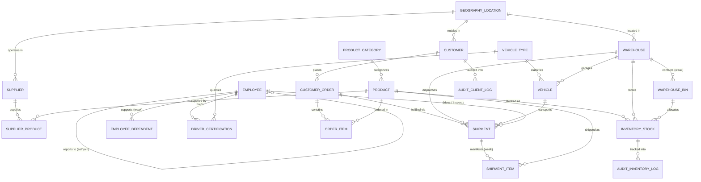

# LogiChain — Supply Chain & Logistics DBMS
### Academic Database Management System for Supply Chain & Logistics

---

## Executive Overview

LogiChain is an academic relational database management system designed around supply chain and logistics operations.

The core schema models and manages customers, orders, products, suppliers, warehouses, inventory, shipments, vehicles, and employees across 20 normalized relational entities.

The repository includes a comprehensive set of DBMS implementations mapped directly to the university DBMS syllabus (CSE3001), including relational algebra, mathematical normalization proofs (1NF to 4NF), view definitions, index structures, triggers, transaction controls with savepoints, and a 100% native Oracle 19c/21c PL/SQL suite with packages, cursors, custom exceptions, and stored routines.

### Key Highlights

- **Core Relational Database**
  - 20 normalized tables with primary keys, foreign key referential integrity (`ON DELETE CASCADE`, `ON DELETE RESTRICT`), and `CHECK` constraints.
  - Customers, orders, items, products, categories, suppliers, warehouses, bins, inventory stocks, vehicles, types, certifications, employees, dependents, and audit logs.

- **Standard SQL Functionality**
  - Multi-table inner, outer, and self-joins.
  - Subqueries, correlated `EXISTS`, and Relational Division ($\div$).
  - Updatable views (`WITH CHECK OPTION`) and security views.
  - Performance B-Tree and composite indexes.
  - Transparent audit triggers and business-rule enforcement triggers.
  - Transaction Control Language (`BEGIN`, `SAVEPOINT`, `ROLLBACK TO SAVEPOINT`, `COMMIT`).

- **Oracle PL/SQL Suite**
  - Modular package specifications and package bodies (`PKG_LOGICHAIN_DISPATCH`).
  - Explicit cursor loops, `SQL%ROWCOUNT`, and batch savepoint rollbacks.
  - User-defined exceptions, exception handling, and error codes.
  - Stored procedures with `IN` and `OUT` parameters and SQL-callable stored functions.

- **Pure Terminal CLI Interface**
  - Terminal runner built with Rich, providing formatted tables and menus without requiring external web servers or GUIs.

---

## CSE3001 Syllabus & Lab Experiments Coverage Matrix

| Unit / Lab No. | Topic in Syllabus | LogiChain Implementation | Source File Link |
| :--- | :--- | :--- | :--- |
| **Unit 1** | ANSI-SPARC 3-Level Architecture, Data Independence, ER Diagrams, Weak Entity Sets, Attribute Types, Cardinalities | 3-Level Views, ER Crow's Foot specs, weak entities (`SHIPMENT_ITEM`, `WAREHOUSE_BIN`, `EMPLOYEE_DEPENDENT`), composite/multivalued mappings. | [database_design.md](file:///home/muaviz/collegedev/logichain/docs/database_design.md), [er_diagram.mermaid](file:///home/muaviz/collegedev/logichain/docs/diagrams/er_diagram.mermaid) |
| **Unit 2** | Relational Models, Integrity Rules, Relational Algebra, Calculus (TRC), Normalization (1NF to 4NF) | Foreign key actions (`ON DELETE CASCADE`), formal $\sigma, \pi, \bowtie, \div, \cup, -, \rho, \gamma$ queries, 1NF–4NF decomposition and lossless join proofs. | [relational_algebra.md](file:///home/muaviz/collegedev/logichain/docs/theoretical/relational_algebra.md), [normalization_proofs.md](file:///home/muaviz/collegedev/logichain/docs/theoretical/normalization_proofs.md) |
| **Unit 3** | SQL DDL/DML/TCL, Joins, Subqueries, Aggregate Functions, Updatable & Materialized Views, Triggers, Sequences, Indexes | Master DDL, complex multi-table joins, correlated `EXISTS`, updatable views `WITH CHECK OPTION`, performance indexes. | [01_ddl_tables.sql](file:///home/muaviz/collegedev/logichain/sql/schema/01_ddl_tables.sql), [01_performance_indexes.sql](file:///home/muaviz/collegedev/logichain/sql/indexes/01_performance_indexes.sql), [01_updatable_views.sql](file:///home/muaviz/collegedev/logichain/sql/views/01_updatable_views.sql) |
| **Unit 4** | PL/SQL, %TYPE, %ROWTYPE, Cursors, Stored Procedures/Functions | Native Oracle PL/SQL packages, explicit cursors, stored procedures with `IN`/`OUT` parameters, and stored functions. | [02_oracle_packages.sql](file:///home/muaviz/collegedev/logichain/sql/plsql_oracle/02_oracle_packages.sql), [03_oracle_cursors_savepoints.sql](file:///home/muaviz/collegedev/logichain/sql/plsql_oracle/03_oracle_cursors_savepoints.sql), [05_oracle_procedures_functions.sql](file:///home/muaviz/collegedev/logichain/sql/plsql_oracle/05_oracle_procedures_functions.sql) |
| **Unit 5** | ACID Properties, Isolation Levels, Serializability, 2PL Protocols | Formal ACID lifecycle documentation, ANSI isolation levels, Two-Phase Locking specifications, and live savepoint transaction execution. | [acid_and_isolation.md](file:///home/muaviz/collegedev/logichain/docs/transactions/acid_and_isolation.md), [transactions_tcl.sql](file:///home/muaviz/collegedev/logichain/sql/queries/transactions_tcl.sql) |
| **Lab 1** | Airline Flight & Pilot Certification (Complex Joins & Division) | Fleet vehicle and driver certification queries with Relational Division ($\div$) over certified vehicles. | [lab01_certification_queries.sql](file:///home/muaviz/collegedev/logichain/sql/queries/lab_equivalents/lab01_certification_queries.sql) |
| **Lab 2** | Sailors, Boats & Reserves (25 Queries: ALL, ANY, Aggregations, Outer Joins) | Complete 25-query benchmark catalog on Driver/Fleet operations matching all 25 queries. | [lab02_sailors_25_queries.sql](file:///home/muaviz/collegedev/logichain/sql/queries/lab_equivalents/lab02_sailors_25_queries.sql) |
| **Lab 3** | Wholesale Product & Spatial Aggregations (Material, Region, City) | Multi-dimensional aggregation queries (`GROUP BY`, `SUM`, `AVG`, `ROUND`) executed directly on normalized relational tables. | [lab03_dimensional_olap.sql](file:///home/muaviz/collegedev/logichain/sql/queries/lab_equivalents/lab03_dimensional_olap.sql) |
| **Lab 4** | Shipping Manifest Implicit Cursor & Hot DB Backup Script | PL/SQL block utilizing `SQL%FOUND`, `SQL%ROWCOUNT` + hot database backup/restore shell automation. | [03_oracle_cursors_savepoints.sql](file:///home/muaviz/collegedev/logichain/sql/plsql_oracle/03_oracle_cursors_savepoints.sql), [backup_restore.sh](file:///home/muaviz/collegedev/logichain/scripts/backup_restore.sh) |
| **Lab 5** | Transparent Audit System on Client_Master (`AUDIT_CLIENT_LOG`) | Trigger tracking `UPDATE` and `DELETE` on `CUSTOMER` with before-image balance, operation type, user, and timestamp. | [01_audit_triggers.sql](file:///home/muaviz/collegedev/logichain/sql/triggers/01_audit_triggers.sql) |
| **Lab 6** | Supplier & Parts Cursor with Savepoints, Deleting Every 10th Row & ON DELETE CASCADE | Explicit cursor loop committing in batches, rolling back to savepoints, deleting every Nth row with cascade verification. | [03_oracle_cursors_savepoints.sql](file:///home/muaviz/collegedev/logichain/sql/plsql_oracle/03_oracle_cursors_savepoints.sql) |
| **Lab 7** | Mutual Exclusivity Business Rule with Custom Exceptions | Enforces separation of duties (Driver cannot be Quality Inspector on same shipment), raising user-defined exceptions. | [04_oracle_exceptions.sql](file:///home/muaviz/collegedev/logichain/sql/plsql_oracle/04_oracle_exceptions.sql) |
| **Lab 8 & 9** | Stored Procedures with IN/OUT, SQL-Callable Stored Function & 10% Salary Bump | Stored procedure returning Driver Name & Salary via `OUT` parameters, function returning depot location in SQL, 10% raise script. | [05_oracle_procedures_functions.sql](file:///home/muaviz/collegedev/logichain/sql/plsql_oracle/05_oracle_procedures_functions.sql) |
| **Lab 10** | Trigger Raising User-Defined Error to Block Unauthorized DML | Triggers preventing unauthorized price reductions > 75% or discontinued product ordering with custom error codes. | [02_business_rule_triggers.sql](file:///home/muaviz/collegedev/logichain/sql/triggers/02_business_rule_triggers.sql), [04_oracle_exceptions.sql](file:///home/muaviz/collegedev/logichain/sql/plsql_oracle/04_oracle_exceptions.sql) |
| **Lab 11** | Employee & Department Hierarchy (Self-Joins, Boss of President = NULL, Subordinate Rankings) | Recursive hierarchy queries, department groupings, President NULL boss handling, and subordinate counts descending. | [lab11_employee_hierarchy.sql](file:///home/muaviz/collegedev/logichain/sql/queries/lab_equivalents/lab11_employee_hierarchy.sql) |

---

## System Architecture & Entity-Relationship (ER) Model



---

## Quickstart & Interactive Demonstration

### 1. Initialize Database & Seed Records
```bash
./scripts/setup_database.sh
```

### 2. Launch the Interactive Rich Terminal CLI
```bash
python3 -m src.cli
```
The CLI provides an interactive terminal interface for exploring the database:
```
  _             _  ____ _           _       
 | |   ___   __ _(_)/ ___| |__   __ _(_)_ __  
 | |  / _ \ / _` | | |   | '_ \ / _` | | '_ \ 
 | | | (_) | (_| | | |___| | | | (_| | | | | |
 |_|  \___/ \__, |_|\____|_| |_|\__,_|_|_| |_|
            |___/                             
 LogiChain - Supply Chain & Logistics DBMS CLI

Main Menu

 [1] View Database Statistics (20 Tables)
 [2] SQL Query Suite (Labs 1, 2, 3, 11)
 [3] Database Triggers & Auditing (Labs 5, 10)
 [4] ACID Transaction & Savepoints Demo
 [5] Oracle PL/SQL Suite Viewer
 [6] Database Management (Re-seed DB)
 [0] Exit
```

### 3. Non-Interactive Demonstration Mode
To run an automated walkthrough of all key demonstrations:
```bash
python3 -m src.cli --demo
```

### 4. Run Pytest Test Suite
```bash
pytest tests/ -v
```

### 5. Automated Database Backup & Restore (Lab 4)
```bash
# Create a hot SQL dump backup
./scripts/backup_restore.sh backup

# Restore from a backup file
./scripts/backup_restore.sh restore backups/logichain_backup_<timestamp>.sql
```

---

## Codebase Directory Layout

```
/home/muaviz/collegedev/logichain/
├── README.md                           <- Master academic documentation & overview
├── requirements.txt                    <- Python dependencies (rich, tabulate, pytest)
├── .env.example                        <- Configuration template
├── docs/                               <- Comprehensive DBMS Syllabus Documentation
│   ├── database_design.md              <- ANSI-SPARC 3-Level Architecture & ER Specs
│   ├── diagrams/
│   │   ├── er_diagram.mermaid          <- High-res Crow's Foot ERD
│   │   └── schema_relational_model.mermaid
│   ├── theoretical/
│   │   ├── relational_algebra.md       <- Formal Relational Algebra & TRC formulas
│   │   └── normalization_proofs.md     <- 1NF to 4NF proofs with FDs & Lossless Join
│   └── transactions/
│       └── acid_and_isolation.md       <- ACID properties, anomalies, 2PL protocols
├── sql/
│   ├── schema/
│   │   ├── 01_ddl_tables.sql           <- Master DDL with 20 tables & relational integrity rules
│   │   └── 02_seed_data.sql            <- Rich enterprise dataset (20 entities)
│   ├── views/
│   │   ├── 01_updatable_views.sql      <- Updatable views (WITH CHECK OPTION)
│   │   ├── 02_security_views.sql       <- User-role security & abstraction views
│   │   └── 03_materialized_views.sql   <- Analytical summary views
│   ├── indexes/
│   │   └── 01_performance_indexes.sql  <- B-Tree, Composite, & Partial indexes
│   ├── triggers/
│   │   ├── 01_audit_triggers.sql       <- Transparent audit triggers (Lab 5)
│   │   ├── 02_business_rule_triggers.sql <- Error-raising triggers (Lab 10)
│   │   └── 03_inventory_sync_triggers.sql
│   ├── plsql_oracle/                   <- 100% Native Oracle PL/SQL Suite
│   │   ├── 01_oracle_ddl_sequences.sql <- Oracle DDL, Sequences, Synonyms
│   │   ├── 02_oracle_packages.sql      <- Modular PL/SQL Packages (Specs & Bodies)
│   │   ├── 03_oracle_cursors_savepoints.sql <- Explicit Cursors, Savepoints (Lab 4, 6)
│   │   ├── 04_oracle_exceptions.sql    <- User-defined exceptions (Lab 7, 10)
│   │   └── 05_oracle_procedures_functions.sql <- Stored routines with IN/OUT (Lab 8, 9)
│   └── queries/
│       ├── lab_equivalents/            <- Direct mapping of Labs 1 to 11
│       │   ├── lab01_certification_queries.sql
│       │   ├── lab02_sailors_25_queries.sql
│       │   ├── lab03_dimensional_olap.sql
│       │   └── lab11_employee_hierarchy.sql
│       ├── advanced_queries.sql        <- Subqueries, Correlated EXISTS, Division
│       ├── set_operations.sql          <- UNION, INTERSECT, EXCEPT / MINUS
│       └── transactions_tcl.sql        <- COMMIT, ROLLBACK, SAVEPOINT scripts
├── src/
│   ├── config.py                       <- Database and environment configuration
│   ├── database.py                     <- Core DB connection and query execution interface
│   ├── schema_loader.py                <- Automated DDL/DML runner and initializer
│   └── cli.py                          <- Interactive Rich Terminal CLI runner
├── tests/
│   ├── test_schema_integrity.py        <- Validates PKs, FKs, CHECK constraints
│   ├── test_triggers_and_audit.py      <- Validates transparent audit logging
│   └── test_lab_queries.py             <- Validates Lab 1 to 11 queries
└── scripts/
    ├── setup_database.sh               <- Automates DB setup & seeding
    └── backup_restore.sh               <- Database backup & restore script (Lab 4)
```
